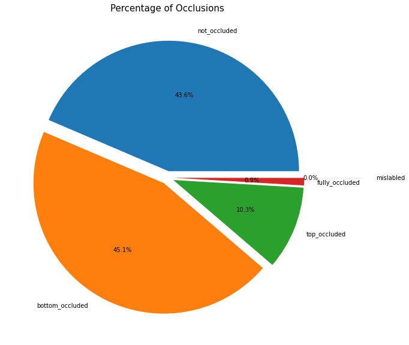

# occluded-face-detection
얼굴에 가려진 부분이 있는 지 찾아내는 모델


## Abstract

1. $C_W = ( 1 - {class \_ samples /all \_ samples} )$ ; custom class weight
2. $C_{W2} = all \_ samples / (num \_ classes\  \times \ class \_ samples )$ ; sklearn class weight

### multi-class, without class weight [pth](https://drive.google.com/file/d/1TRW0mQI8XBRLjMPh8QdchApV08EX_Yjz/view?usp=sharing) [onnx](https://drive.google.com/file/d/1vhRTjgvY8_qPQqWaUd6hT0vUaYVC75Kk/view?usp=sharing)

| dataset | f1_score | precision | recall | accuracy |
| --- | --- | --- | --- | --- |
| train | 0.9845 | 0.9771 | 0.9993 | 0.9549 |
| val | 0.9324 | 0.9152 | 0.9668 | 0.8637 |
| test | 0.9337 | 0.9200 | 0.9614 | 0.8790 |

### multi-class, with Class weight [pth](https://drive.google.com/file/d/1B3Yw1wrufk38ApwaiSgT1vd4Y5xMvIQY/view?usp=sharing) [onnx](https://drive.google.com/file/d/1vini-XvRMxqIfdIHTNi9yGxHfoKuAZ8A/view?usp=sharing)

| dataset | f1_score | precision | recall | accuracy |
| --- | --- | --- | --- | --- |
| train (cw1) | 0.9678 | 0.9518 | 0.9998 | 0.9039 |
| val (cw1) | 0.9246 | 0.9036 | 0.9668 | 0.8404 |
| test (cw1) | 0.9242 | 0.9034 | 0.9661 | 0.8411 |
| train (cw2) | 0.8343 | 0.7664 | 0.9704 | 0.5628 |
| val (cw2) | 0.8166 | 0.7489 | 0.9525 | 0.5462 |
| test (cw2) | 0.8082 | 0.7414 | 0.9423 | 0.5414 |

### Multi-label, without class weight [pth](https://drive.google.com/file/d/1PVh1lp0Gu84qCjAzcR3REEbZo6kTyLDg/view?usp=sharing) [onnx](https://drive.google.com/file/d/1iCht4Flr95CJhqxgGjmIWGOHn5FcI1-o/view?usp=sharing)

| dataset | f1_score | precision | recall | accuracy |
| --- | --- | --- | --- | --- |
| train | 0.9981 | 0.9991 | 0.9977 | 0.9961 |
| val | 0.9402 | 0.9422 | 0.9398 | 0.9335 |
| test | 0.9399 | 0.9415 | 0.9395 | 0.9355 |

### Multi-label, with class weight [pth](https://drive.google.com/file/d/134eQ7o_aryaX3JI3zn7JjkVVMcGMbR6V/view?usp=sharing) [onnx](https://drive.google.com/file/d/1HwlnbauifEqaluHjy9vSnwTKWjxs_yYG/view?usp=sharing)

| dataset | f1_score | precision | recall | accuracy |
| --- | --- | --- | --- | --- |
| train (cw1) | 0.9979 | 0.9991 | 0.9973 | 0.9954 |
| val (cw1) | 0.9473 | 0.9491 | 0.9471 | 0.9402 |
| test (cw1) | 0.9426 | 0.9441 | 0.9422 | 0.9382 |
| train (cw2) | 0.9945 | 0.9962 | 0.9938 | 0.9908 |
| val (cw2) | 0.9377 | 0.9382 | 0.9378 | 0.9355 |
| test (cw2) | 0.9336 | 0.9345 | 0.9339 | 0.9293 |


## 목표

- Mobile에서 Inference가 가능할 것
- FR에 활용할 수 있는 이미지인 것을 찾을 것
- FR에 활용할 수 없다면 수정 요청을 보낼 수 있을 것

### EDA

| Class | Counts |
| --- | --- |
| non_occluded | 6668 |
| bottom_occluded | 6908 |
| top_occluded | 1582 |
| fully_occluded | 141 |
| mislabeled | 2 |



- not_occluded: Occlude되지 않은 Samples
- top_occluded: 윗부분이 Occlude된 Samples
- bottom_occluded: 아랫부분이 Occlude된 Samples
- fully_occluded: 위와 아래 모두 Occluded된 Samples
- mislabeled: 위나 아래에 Occlude가 True인데, Occlude가 False로 나온 Data

mis label이 있다(non occlude인데, top이나 bottom에 occlude)

-> 방향성을 Multi-label classification with class weight로 결정

[Notion](https://aiappbox.notion.site/Occluded-Face-Detection-bac15f3cfa024ef8bd0cab59726c487f) 에 가면 더욱 자세한 실험 설계와 EDA를 볼 수 있다.


## Environment

```
OS: ubuntu 20.04.4 LTS
Python: 3.8.10
```

## Requirements

```
opencv-python==4.6.0
padnas==1.4.3
matplotlib==3.5.2
sklearn==1.1.2

torch==1.12.0+cu113
torchvision==0.13.0+cu113
torchsummary==1.5.1
onnx==1.12.0
```

## Setup

```bash
git clone https://github.com/lee-jingu/occluded-face-detection.git

cd occluded-face-detection
pip3 install -r requirements.txt
```

## Demo

--verbose 옵션을 추가하면 스트링 프린트가 진행됩니다.
```bash
python3 occluded_face/demo.py \
--img-dir ${이미지_디렉토리} \
--verbose
```

## Train

--metric 옵션을 추가하면 학습 후 Metric 결과가 results.txt에 남습니다
```bash
python3 occluded_face/train.py \
--epochs ${num epochs}\
--task ${string "multi-label" // "multi-class"} \
--img-dir ${dataset path} \
--output-dir ${checkpoint path} \
--split-ratio 0.8, 0.1, 0.1
--metric
```

## Test (Metric)

```bash
python3 occluded_face/test.py \
--checkpoint ${checkpoint path} \
--task ${string "multi-label" // "multi-class"} \
--img-dir ${image path}
```

## export onnx

후에 TFLite로 변환하기 쉽기 위해 추가했다.

```bash
python3 occluded_face/export.py
--checkpoint ${checkpoint path} \
--task ${string "multi-label" // "multi-class"} \
--output ${output path}
```
